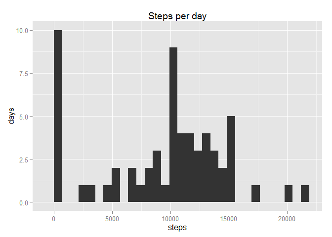
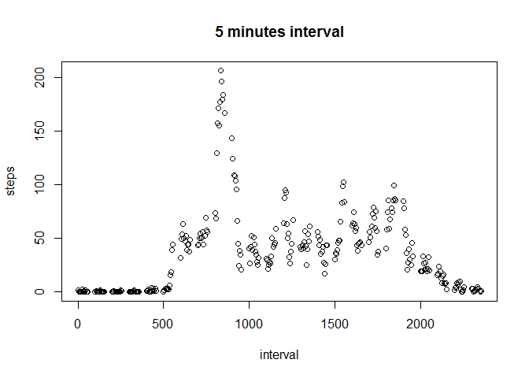
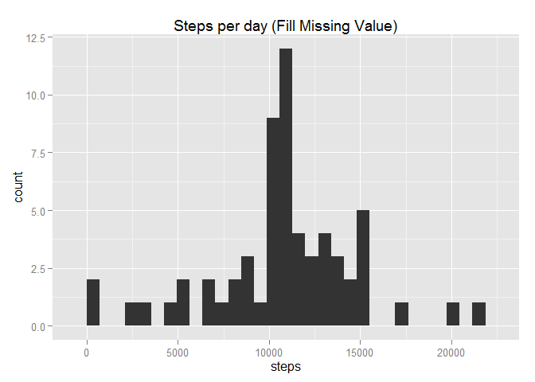
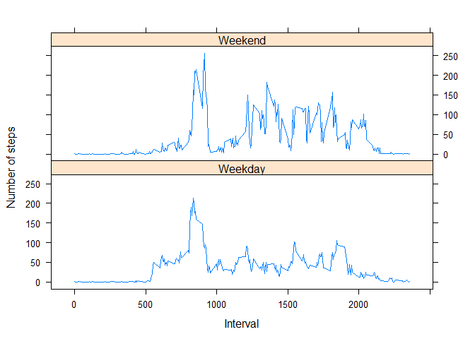

# Reproducible Research: Peer Assessment 1


## Loading and preprocessing the data


```r
#read data
active_data <- read.csv("activity.csv")

#convert variable "date"'s attribute from "factor" to "Date"
active_data$date <- as.Date(as.character(active_data$date))
```

## What is mean total number of steps taken per day?


```r
library(ggplot2)
```

```
## Warning: package 'ggplot2' was built under R version 3.2.1
```

```r
# split data by date
data_by_date <- split(active_data, active_data$date)

steps_per_day <- sapply(data_by_date, function(x) sum(x$steps, na.rm = TRUE))

# make data tidy
steps_per_day <- data.frame(date = names(steps_per_day), steps=steps_per_day, row.names = NULL)

mean_steps_per_day <- mean(steps_per_day$steps)

median_steps_per_day <- median(steps_per_day$steps)

qplot(steps_per_day$steps, geom="histogram") + xlab("steps")
```

 

Mean of totl number of steps per day is  9354.2295082

Median of totl number of steps per day is  10395

## What is the average daily activity pattern?


```r
#turn off scientific notation
options(scipen=999)

five_interval <- split(active_data, active_data$interval)

steps_per_interval <- sapply(five_interval, function(x) mean(x$steps, na.rm = TRUE))

# make data tidy
steps_per_interval <- data.frame(interval = names(steps_per_interval), steps=steps_per_interval, row.names = NULL)
 
steps_per_interval$interval <- as.numeric(as.character(steps_per_interval$interval))

# draw  time series plot
plot(steps_per_interval)
```

 

```r
index_of_max_steps <- which(steps_per_interval$steps == max(steps_per_interval$steps))
```

For 835 interval have max mean steps of  206.1698113


## Imputing missing values

There are 2304 NA value in dataset.


```r
# define a function
guess_steps_by_interval <- function (interval_value)  {
  
  return (steps_per_interval[which(steps_per_interval$interval == interval_value), ]$steps)
}
 
# copy data to a new data to be process
new_data <- active_data
 
# fill NA with new value
for(i in 1:nrow(new_data)) {
  
  if(is.na(new_data[i, ]$steps) == TRUE) {
    
    new_data[i, ]$steps <- round(guess_steps_by_interval(new_data[i, ]$interval))
  }
  
}


# split data by date
data_by_date_new <- split(new_data, new_data$date)

steps_per_day_new <- sapply(data_by_date_new, function(x) sum(x$steps, na.rm = TRUE))

# make data tidy
steps_per_day_new <- data.frame(date = names(steps_per_day_new), steps=steps_per_day_new, row.names = NULL)

mean_steps_per_day_new <- mean(steps_per_day_new$steps)

median_steps_per_day_new <- median(steps_per_day_new$steps)

qplot(steps_per_day_new$steps, geom="histogram") +  xlab("steps")
```

 

Mean of totl number (NA processed) of steps per day is  10765.6393443 while old mean is 9354.2295082

Median of totl number (NA processed) of steps per day is  10762 while old median is  10395

## Are there differences in activity patterns between weekdays and weekends?


```r
library(lubridate)
```

```
## Warning: package 'lubridate' was built under R version 3.2.1
```

```r
#Change Language to English
Sys.setlocale("LC_TIME", "English")
```

```
## [1] "English_United States.1252"
```

```r
# Add a new column indicate is this day a weekend or
new_data$day <- ifelse((weekdays(new_data$date) == "Sunday" ), 
                       "weekend", "weekday")

new_data$day <- ifelse((weekdays(new_data$date) == "Saturday"), 
                       "weekend", "weekday")

new_data$day <- as.factor(new_data$day)

# prepare compare plot

data_by_weekday <- split(new_data, new_data$day)


caculate_interval_patern <- function(d) {
  
  fi <- split(d, d$interval)

  steps_per_interval_local <- sapply(fi, function(x) mean(x$steps, na.rm = TRUE))
  
  # make data tidy
  steps_per_interval_local <- data.frame(interval = names(steps_per_interval_local), 
                                         steps=steps_per_interval_local, row.names = NULL)
   
  steps_per_interval_local$interval <- as.numeric(as.character(steps_per_interval_local$interval))
  
  return(steps_per_interval_local)
  
}

weekday_patern <- caculate_interval_patern(data_by_weekday$weekday)

weekend_patern <- caculate_interval_patern(data_by_weekday$weekend)

# plot differnt
par(mfrow = c(2,1))
plot(weekday_patern, type = "l", xlab = "interval", ylab= "Number of steps", main = "weekday")
plot(weekend_patern, type = "l", xlab = "interval", ylab= "Number of steps", main = "weekend")
```

 


